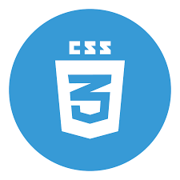
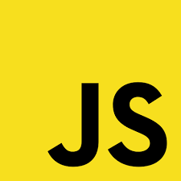
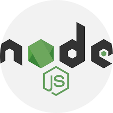

### Hi 👋

I am junior front-end developer. I am working in small projects . I love to leran new things so i am alwasys in learning process to improve my skill as fullstack developer . I learn web development in [HackYourFutur Belgium](https://hackyourfuture.be/). You can reach me feruzteame24@gmail.com.

